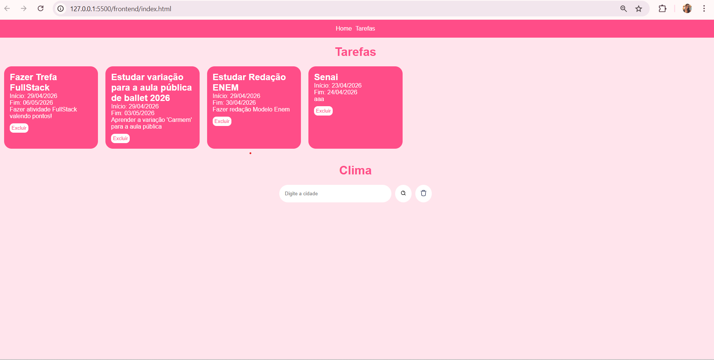
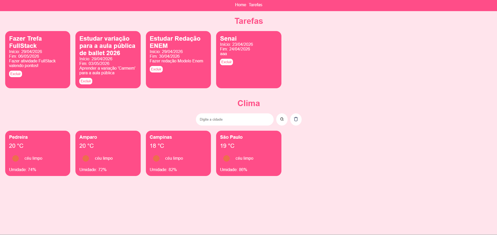
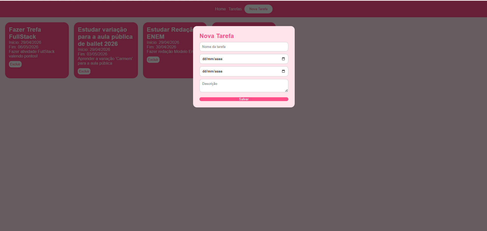

# Daily Check

## O que é o projeto
O **Daily Check** é um sistema web que combina duas funcionalidades principais:

- Gerenciamento de tarefas  
- Consulta de clima em tempo real  

O objetivo do projeto é ajudar o usuário a organizar suas atividades do dia a dia enquanto acompanha as condições climáticas de diferentes cidades.

---

## Tecnologias Utilizadas

### Frontend
- HTML  
- CSS  
- JavaScript (Fetch API)  

### Backend
- Node.js  
- Express  
- Prisma ORM  
- MySQL  

### API Externa
- OpenWeatherMap  

---

## Como testar o projeto

### Backend

1. Instale as dependências:
```bash
npm install
````

2. Configure o arquivo `.env`:

```env
PORT=3000
DATABASE_URL="mysql://root@localhost:3306/seubanco"
```

3. Execute o Prisma:

```bash
npx prisma migrate dev
```

4. Inicie o servidor:

```bash
node server.js
```

---

### Frontend

1. Abra o projeto com Live Server
   ou execute:

```bash
npx live-server
```

2. Acesse no navegador:

```
http://localhost:3000
```

---

## Prints do Projeto

|  |  |
| :------------------------: | :------------------------: |
|   Home (Tarefas - Clima)   |      Cards de Clima     |

|  | 
| :------------------------: | 
|      Modal Cadastro Nova Atividade    |  

